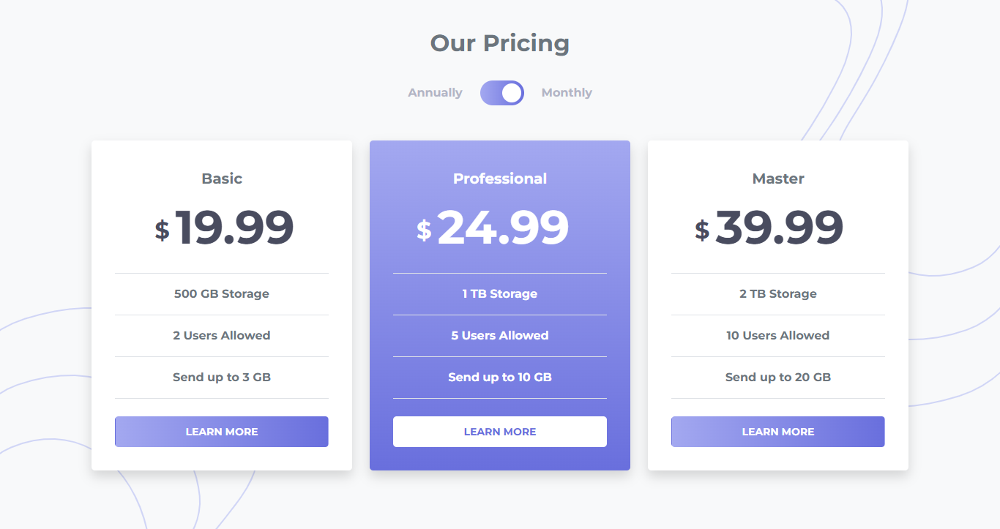

# Pricing component with toggle

## Welcome! 👋

Thanks for checking out this front-end coding project.

## The project

Here I have built out this pricing component.

You should be able to:

- View the optimal layout for the component depending on their device's screen size
- Control the toggle

## My process

### Built with

- Bootstrap
- SASS
- Mobile-first workflow
- Javascript
  - addEventListener
  - querySelector
  - if ... else

